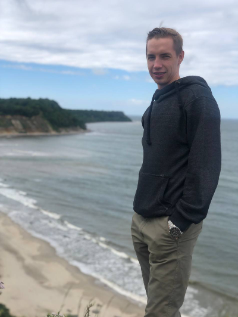

# Zubkov Igor Konstantinovich(4iTeRiNo)
Hello, i'am technical specialist 1c program and online sales register (> 1year). I want to learn a profession of a junior JavaScript developer and working a project cool and to be
closer community of developers.

 

## Experience :
- [ООО "Сирис"](https://mysiris.ru/) (Сирис,LLC) - online automatization business company; 
1. I came to this sector from another area and after a couple of months I worked independently;
2. Strengthened basic computer knowledge at the advanced user level;
3. Optimized workflows, which made it possible to speed up the solution of many tasks;

## Education :
- Completed higher education;
- Rsschool courses

## Technologies :
- HTML5
- CSS3
- JavaScript

## Soft skills :
- Stress resistance;
- Purposefulness;
- Ability to work in a team;
- Communication skills;

## Hard skills : 
- VS Code;
- GitHub;
- Figma;

## Project :
- [Interior-website](https://4iterino.github.io/Interior-sait/): grid, bootstrap 5;
- [ZubkovIgor-CV]();
## Who to contact me :
- **Phone** `+79831013668`;
- **Telegram** `[@Igor0515](https//t.me/Igor0515)`;
- **GitHub** `[4iTeRiNo](https://github.com/4iTeRiNo)`;
- **Facebook** `[Игорь Зубков]()`;
- **Email** ` `;
- **discord** `Igor (4iTeRiNo)`;
=======
# Zubkov Igor Konstantinovich
Hello, i'am technical specialist 1c program and online sales register (> 1year). I want to learn a profession of a junior JavaScript developer. I like technology and travel.

 

## Summary about me :
- 

*Who to contact me :* 
- **Phone** [`+79831013668`](number+79831013668)
- Telegram [@Igor0515](https//t.me/Igor0515)
- GitHub [4iTeRiNo](https://github.com/4iTeRiNo)
- Facebook [Игорь Зубков]()

## Technologies
- HTML5
- CSS3
- JavaScript
- GitHub
- Visual Studio Code

## Education
	Completed higher education

